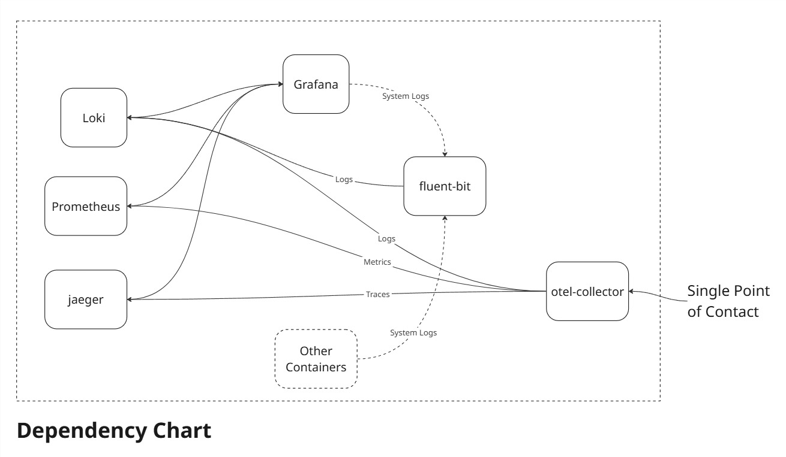

# SKB - Monitoring and Observability Solution

This solution provides a single ended Monitoring and Observability solution. 
By the term **Single Ended Solution**, we implement the system in a way that there is only one point of interaction.



All application using this infrastructure, would only be needed to implement and configure the OpenTelemetry plugins.

## Getting Started
First, change to the deploy folder within `MonitorAndObserve`
```bash
cd ./MonitorAndObserver/deploy
``` 

Execute following command to bring up the infrastructure:
```bash
docker compose up -d 
```

Execute following command to bring down the infrastructure:
```bash
docker compose down
```

## Example
For the Examples, refer to the OpenTelemetry implementations.
[Here is an example for C#](https://learn.microsoft.com/en-us/dotnet/core/diagnostics/observability-prgrja-example).